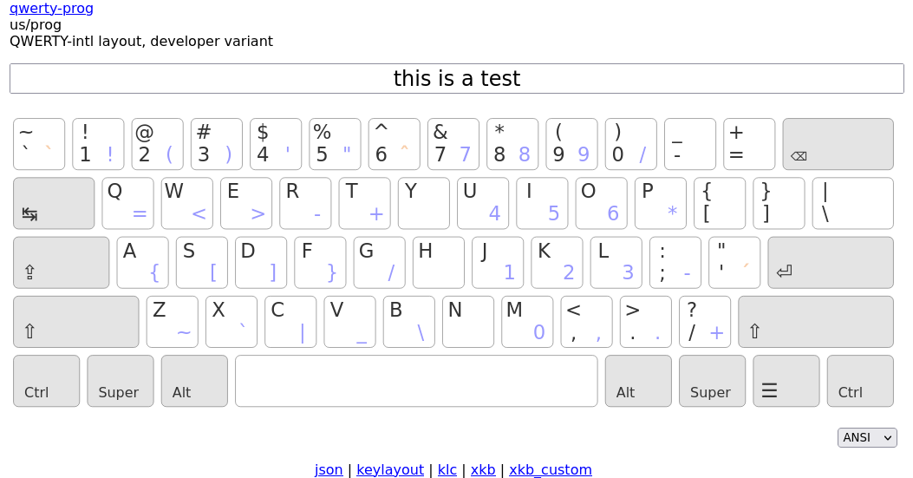

Kalamine
================================================================================

A text-based, cross-platform Keyboard Layout Maker.


Install
--------------------------------------------------------------------------------

All you need is a Python environment:

.. code-block:: bash

   pip install kalamine

If you get a ``UnicodeEncodeError`` on Windows, try specifying this environment variable before executing Kalamine:

.. code-block:: powershell

    $Env:PYTHONUTF8 = 1


Layout Generation
--------------------------------------------------------------------------------

Draw your keyboard layout in one of the provided ASCII-art templates and include it in a TOML document:

.. code-block:: toml

    name = "qwerty-ansi"
    name8 = "q-ansi"
    description = "QWERTY-US layout"
    version = "1.0.0"
    geometry = "ANSI"

    base = '''
    ┌─────┬─────┬─────┬─────┬─────┬─────┬─────┬─────┬─────┬─────┬─────┬─────┬─────┲━━━━━━━━━━┓
    │ ~   │ !   │ @   │ #   │ $   │ %   │ ^   │ &   │ *   │ (   │ )   │ _   │ +   ┃          ┃
    │ `   │ 1   │ 2   │ 3   │ 4   │ 5   │ 6   │ 7   │ 8   │ 9   │ 0   │ -   │ =   ┃ ⌫        ┃
    ┢━━━━━┷━━┱──┴──┬──┴──┬──┴──┬──┴──┬──┴──┬──┴──┬──┴──┬──┴──┬──┴──┬──┴──┬──┴──┬──┺━━┯━━━━━━━┩
    ┃        ┃ Q   │ W   │ E   │ R   │ T   │ Y   │ U   │ I   │ O   │ P   │ {   │ }   │ |     │
    ┃ ↹      ┃     │     │     │     │     │     │     │     │     │     │ [   │ ]   │ \     │
    ┣━━━━━━━━┻┱────┴┬────┴┬────┴┬────┴┬────┴┬────┴┬────┴┬────┴┬────┴┬────┴┬────┴┲━━━━┷━━━━━━━┪
    ┃         ┃ A   │ S   │ D   │ F   │ G   │ H   │ J   │ K   │ L   │ :   │ "   ┃            ┃
    ┃ ⇬       ┃     │     │     │     │     │     │     │     │     │ ;   │ '   ┃ ⏎          ┃
    ┣━━━━━━━━━┻━━┱──┴──┬──┴──┬──┴──┬──┴──┬──┴──┬──┴──┬──┴──┬──┴──┬──┴──┬──┴──┲━━┻━━━━━━━━━━━━┫
    ┃            ┃ Z   │ X   │ C   │ V   │ B   │ N   │ M   │ <   │ >   │ ?   ┃               ┃
    ┃ ⇧          ┃     │     │     │     │     │     │     │ ,   │ .   │ /   ┃ ⇧             ┃
    ┣━━━━━━━┳━━━━┻━━┳━━┷━━━━┱┴─────┴─────┴─────┴─────┴─────┴─┲━━━┷━━━┳━┷━━━━━╋━━━━━━━┳━━━━━━━┫
    ┃       ┃       ┃       ┃                                ┃       ┃       ┃       ┃       ┃
    ┃ Ctrl  ┃ super ┃ Alt   ┃ ␣                              ┃ Alt   ┃ super ┃ menu  ┃ Ctrl  ┃
    ┗━━━━━━━┻━━━━━━━┻━━━━━━━┹────────────────────────────────┺━━━━━━━┻━━━━━━━┻━━━━━━━┻━━━━━━━┛
    '''

Build it:

.. code-block:: bash

    kalamine layouts/ansi.toml

Get all keyboard drivers:

.. code-block:: bash

    dist/
     ├─ q-ansi.klc         # Windows
     ├─ q-ansi.keylayout   # macOS
     ├─ q-ansi.xkb         # Linux (user)
     ├─ q-ansi.xkb_custom  # Linux (root)
     └─ q-ansi.json        # web

You can also ask for a single target by specifying the file extension:

.. code-block:: bash

    kalamine ansi.toml --out q-ansi.xkb_custom


Layout Emulation
--------------------------------------------------------------------------------

Your layout can be emulated in a browser — including dead keys and an AltGr layer, if any.


.. code-block:: bash

    $ kalamine layouts/prog.toml --watch
    Server started: http://localhost:8080

Open your browser, type in the input area, test your layout. Changes on your TOML file are not auto-detected yet, you’ll have to refresh the page manually.



Press Ctrl-C when you’re done, and kalamine will write all platform-specific files.


Layout Installation
--------------------------------------------------------------------------------

Windows
```````

* get a keyboard layout installer: MSKLC_ (freeware) or KbdEdit_ (shareware);
* load the ``*.klc`` file with it;
* run this installer to generate a setup program;
* run the setup program;
* the keyboard layout appears in the language bar.

.. _MSKLC: https://www.microsoft.com/en-us/download/details.aspx?id=102134
.. _KbdEdit: http://www.kbdedit.com/

macOS
`````

* copy your ``*.keylayout`` file into:

  * either ``~/Library/Keyboard Layouts`` for the current user only,
  * or ``/Library/Keyboard Layouts`` for all users;

* restart your session;
* the keyboard layout appears in the “Language and Text” preferences, “Input Methods” tab.

Linux (root)
````````````

Recent versions of XKB allow *one* custom keyboard layout in root space:

.. code-block:: bash

    sudo cp layout.xkb_custom /usr/share/X11/xkb/symbols/custom

Your keyboard layout will be listed as “Custom” in the keyboard settings.

On Xorg you can also select your keyboard layout from the command line:

.. code-block:: bash

    setxkbmap custom  # select your keyboard layout
    setxkbmap us      # get back to QWERTY

Linux (user)
````````````

On Linux, if the ``xkb/symbols/custom`` hack can’t be used, ``*.xkb`` keyboard descriptions can be applied in user-space with ``xkbcomp``:

.. code-block:: bash

    xkbcomp -w10 layout.xkb $DISPLAY

This has limitations:

* the keyboard layout won’t show up in the keyboard settings
* media keys might stop working
* unlikely to work on Wayland

Again, ``setxkbmap`` can be used to get back to the standard us-qwerty layout:

.. code-block:: bash

    setxkbmap us


XKalamine
--------------------------------------------------------------------------------

``xkalamine`` is a Linux-specific CLI tool for managing keyboard layouts with XKB.

.. code-block:: bash

    # Apply a keyboard layout in user-space
    # (equivalent to `xkbcomp -w10 layout.xkb $DISPLAY`)
    xkalamine apply layout.toml

    # Install a keyboard layout into /usr/share/X11/xkb
    sudo xkalamine install layout.toml

    # Uninstall Kalamine layouts from /usr/share/X11/xkb
    sudo xkalamine remove us/prog     # remove the kalamine 'prog' layout
    sudo xkalamine remove fr          # remove all kalamine layouts for French
    sudo xkalamine remove "*"         # remove all kalamine layouts

    # List available keyboard layouts
    xkalamine list                    # list all kalamine layouts
    xkalamine list fr                 # list all kalamine layouts for French
    xkalamine list us --all           # list all layouts for US English
    xkalamine list --all              # list all layouts, ordered by locale

Using ``xkalamine`` with ``sudo`` currently supposes kalamine has been installed as root (hopefully in a pyenv). Which really sucks, and we’re working on a better solution.

XKB is a tricky piece of software. The following resources might be helpful if you want to dig in:

* https://www.charvolant.org/doug/xkb/html/
* https://wiki.archlinux.org/title/X_keyboard_extension
* https://wiki.archlinux.org/title/Xorg/Keyboard_configuration
* https://github.com/xkbcommon/libxkbcommon/blob/master/doc/keymap-format-text-v1.md

    If you want custom keymaps on your machine, switch to Wayland (and/or fix any remaining issues preventing you from doing so) instead of hoping this will ever work on X.

    -- `Peter Hutterer`_

.. _`Peter Hutterer`: https://who-t.blogspot.com/2020/09/no-user-specific-xkb-configuration-in-x.html


Alternative
--------------------------------------------------------------------------------

https://github.com/39aldo39/klfc
